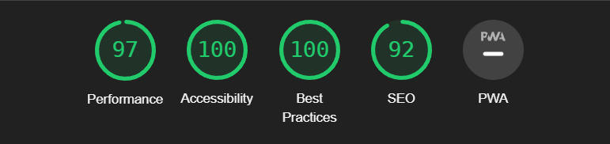

# Quenington Wildlife Park

Quenington Wildlife Park is the website of a **fictitious** wildlife park.

The park has a large forest and a lake. It has a wide variety of birds and animals for the public to see. It has animals like the red squirrels and deer, and has variety of birds like chaffinch, crested grebe, common moorhen, eurasian jay and many more. It has a cafeteria serving drinks and refreshments to vistors. The park is open everyday from spring to autumn every year.

The site is targeted towards those who want to see the animals and birds in its natural habitat.

**Note:** - the description of the park and its facilities are a complete work of fiction.

## Purpose of Website (Features)

The purpose of the website is to promote and advertise the wildlife park to the general public. It contains information about what animals and birds to see, opening times, location of the park, admission prices and contact details.

## Design

### Technologies Used:

- HTML and CSS

### Header, Navigation Bar and Footer

The header, navigation bar and footer is featured throughout the website.  The header has the title of the website.

The navigation bar has links to all the pages of the website. It has the menu links item arranged vertically for devices with screen widths of less than 800 pixels. This is to make it easy for mobile and tablet users to navigate and tap on the link.
On devices with screens wider than 800 pixels on devices such as laptop, desktops and navigation items are arranged horizontally.

The footer has links to social media sites and as with the navigation bar, links are arranged vertically for screen widths less than 800 pixels and horizontally for wider screens.

### Home (landing page)

The home page is the landing page and its purpose is to advertise the wildlife park. It has two paragraphs: the first describes what is here and what to see; the second is about a cafe serving refreshments such as drinks and meals.

### Gallery

- the list of wild birds and animals that can seen

### More Info

The page contains:
- the opening times of the park
- the admission prices
- link to google map showing the location
- the address and contact details

### Existing Features

## Testing

### Validator Testing

- All web files (html) have been tested using [W3C Markup Validation Service](https://validator.w3.org/). All files have passed the test and no errors were found.

- The style.css file (css) have been tested using [W3C CSS Validation Service](https://jigsaw.w3.org/css-validator/). The file has passed the test and errors were found.

- The lighthouse report for mobile devices is shown below

- The lighthouse report for desktop devices is shown below

### Unfixed Bugs

The website has been tested and all known bugs have been found and fixed.

## Credits

All the code and written paragraphs on this website are of my creation.

### Media

- There are 11 images used on the website. All have been taken from [Pexels](https://www.pexels.com/) website.
- In each img tag used in the website the link to the individual image have been placed in the Alt attribute

### Content

## Deployment

The website was deployed to GitHub using the steps below
- from the GitHub account home page, navigate to the quenington-wildlife-park repository
- on the top navigation bar click on Settings
- on the left side menu click on Pages
- from the source section drop-down menu, select the Master Branch

After the master branch has been selected, the page will be deployed after a few minutes.

The website is now deployed and is at [redfoxofwealden.github.io/quenington-wildlife-park/](https://redfoxofwealden.github.io/quenington-wildlife-park/)
