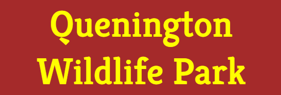

# Quenington Wildlife Park

Quenington Wildlife Park is the website of a **fictitious** wildlife park.

The park has a large forest and a lake. It has a wide variety of birds and animals for the public to see. It has a cafeteria serving drinks and refreshments to the vistors. The park is open everyday from spring to autumn every year.

The site is targeted towards those who want to see the animals and birds in its natural habitat.

**Note:** - the description of the park and its facilities are a complete work of fiction.

## Purpose of Website (Features)

The purpose of the website is to promote the wildlife park to the public. It contains information about what animals and birds see, opening times, location of the park, admission prices and contact details.

**Technologies Used**:  HTML and CSS

All the pages have the following:

- header section at the top of page with the title of the park
- navigation section underneath the header with links to all the pages
- main section: contents will depend on which page is displayed
- footer section at the bottom of the page features links to social media sites: Facebook, Twitter and Instagram

### Header and Navigation Bar

The header shown below has the title of website and is featured on all the pages of the site. 

The navigation bar has the menu items arranged vertically as shown below. This is to make it easy for user mobile to navigate and menu.

On tablets, laptop, desktops and navigation items are arranged horizontally as shown below.

### Home

- image of the woodland and a concise description of the park, what birds and animals the public can see
- image of cup of tea and a brief description of the café where the vistors can have refreshments

### Gallery

- the list of wild birds and animals that can seen

### More Info

- the opening times of the park and second the admission prices
- google map showing the location
- section containing the address and contact details

### Existing Features

## Testing

### Validator Testing

### Unfixed Bugs

## Deployment

## Credits

### Media

- There are 11 images used on the website. All have been taken from [Pexels](https://www.pexels.com/) website.
- In each img tag used in the website the link to the individual image have been placed in the Alt attribute

### Content

- Ideas for which birds and animals to include in the website have been inspired from [Wikipedia](https://en.wikipedia.org/wiki/Main_Page).
-
