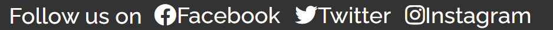

# Quenington Wildlife Park

Quenington Wildlife Park is the website of a **fictitious** wildlife park.

The park has a large forest and a lake. It has a wide variety of birds and animals for the public to see. It has animals like the red squirrels and deer, and has variety of birds like chaffinch, crested grebe, common moorhen, eurasian jay and many more. It has a cafeteria serving drinks and refreshments to vistors. The park is open everyday from spring to autumn every year.

## Purpose of Website

The website is targeted towards those who want to see the animals and birds in its natural habitat.

The purpose of the website is to promote and advertise the wildlife park to the general public. It contains information about what animals and birds to see, opening times, location of the park, admission prices and contact details.

## Design

The website is designed so that it can be displayed on smartphones, tablets, laptop and desktops. The screen width is capped at maximum display of 1200 pixels on the 'Home' page (landing page) and the 'About Us' page. This is ensure that the contents stay within the central vision of the user on wide screen devices, thus making it easier for the user to read. On devices with screen widths of 800 pixels or more the menu items on the navigation bar and the social links on footer are displayed horizontally. This is done create as much space on the screen to display as much information as possible.

### Features

#### The Header

The header is featured on all the web pages, and has the title of the website.

#### Navigation Bar

The navigation bar is featured throughout the site, and has links to all the pages of the website. It has the menu items arranged vertically for devices with screen widths of less than 800 pixels. This is to make it easy for mobile and tablet users to navigate and tap on the link. The screen shot below shows the arrangement of menu items that is displayed on devices such as smartphone and tablets.

On devices with screens wider than 800 pixels on devices such as laptop, desktops and navigation items are arranged horizontally as shown below. The navigation bar is also anchored at the bottom of the device's browser screen.

#### The Footer

The footer has links to social media sites. It allows the user to follow and keep up with events at the wildlife park.

The footer has links are arranged vertically for screen widths less than 800 pixels for devices like smartphones and tablets as shown below.

For screen widths of 800 pixels or more for devices like laptops and desktops, the menu items are arranged horizontally as shown below. Also the footer is fixed to the bottom of the screen in the browser.

### The Home Page (Landing Page)

Link to [Home Page](https://redfoxofwealden.github.io/quenington-wildlife-park/index.html)

The purpose of the home page (landing page) is to advertise the wildlife park. It has two sections, each with an image: the first describes what is here and what to see; the second is about a cafe serving refreshments such as drinks and lunch meals.

The images and text are arranged vertically when displayed on devices screen width less than 800 pixels. On screen width larger than 800 pixels the images and text are display side-by-side using css flex.

#### What's Here

'What's Here' purpose is to advertise the wildlife park to the public. It describes what can be seen here when the park is open. The text is displayed beneath the image for devices with screen widths less than 800 pixels, such as on smartphones and tablets. For wider screen widths for laptops or desktop pcs the text is displayed beside the image so that all the information is displayed on screen and the user doesn't have to scroll.

#### Cafeteria

'Cafeteria' purpose is to advertise the wildlife park's refreshment facility to the public.

For devices with screen widths less than 800 pixels such as on, smartphones and tablets, the text is displayed beneath the image.

For devices with screen widths 800 pixels or wider such as on, smarlaptops or desktop pcs, the text is displayed beside the image. The technology used to accomplish this is css flex.

### Gallery

Link to [Gallery Page](https://redfoxofwealden.github.io/quenington-wildlife-park/gallery.html)

The page displays nine images of different species of birds and animals with the description below each. It shows a sample of what birds or animals to see here. These are displayed below each other on devices with screen width of less than 800 pixels. On wider screens 800 pixels or wider, two images are displayed per row. On devices with screen widths of 1200 pixels, three images are displayed per row. The technology used to accomplish this is css flex.

### About Us

Link to [About Us](https://redfoxofwealden.github.io/quenington-wildlife-park/about-us.html)

The 'About Us' page displays the following sections:

- Opening Times
- Admission Prices
- 'Where to Find Us' has a link to Google maps showing the location
- Telephone and email address

## Testing

The website was tested using Google Chrome and Firefox after it was deployed to GitHub.
No major bugs were found during development. However there were twoissues that were encountered.

**Home Page**

The first attempt to move the texts beside the image using css float did not work out: the texts ended up pack together at the top. So to correct this css flex had to be used instead.

**Footer**
The first attempt to fix the footer to the bottom of the screen using css flex was not successful. There was gap between the footer and bottom of the screen.  This was corrected using css fixed position.

### Validator Testing

- All web files (html) have been tested using [W3C Markup Validation Service](https://validator.w3.org/). All files have passed the test and no errors were found.

- The style.css file (css) have been tested using [W3C CSS Validation Service](https://jigsaw.w3.org/css-validator/). The file has passed the test and errors were found.

### Lighthouse report

The lighthouse report has been generated for following pages:-

#### Home page for desktop devices

#### Home page for mobile devices

#### Gallery page for desktop devices

#### Gallery page for mobile devices

#### About Us page for desktop devices

#### About Us page for mobile devices

### Unfixed Bugs

The website has been tested and all known bugs have been found and fixed.

## Deployment

The website was deployed to GitHub using the steps below

- from the GitHub account home page, navigate to the quenington-wildlife-park repository
- on the top navigation bar click on Settings
- on the left side menu click on Pages
- from the source section drop-down menu, select the Main Branch

After the Main Branch has been selected, the site will be deployed after a few minutes.

The website is now deployed and is at [redfoxofwealden.github.io/quenington-wildlife-park/](https://redfoxofwealden.github.io/quenington-wildlife-park/)

## Credits

### Content

The inspiration for the website was taken from the [Love Running](https://github.com/Code-Institute-Solutions/readme-template) site.

The know-how and information for the css flex technology used on the 'Home' and 'Gallery' pages were inspired and taken from these articles:

- [A Complete Guide to Flexbox](https://css-tricks.com/snippets/css/a-guide-to-flexbox/)
- [Flexbox on MDN site](https://developer.mozilla.org/en-US/docs/Learn/CSS/CSS_layout/Flexbox)
- [CSS Flexbox on W3Schools site](https://www.w3schools.com/css/css3_flexbox.asp)

Of the three articles, the 'A Complete Guide to Flexbox' was the most useful.

All the code and written content on this website are my own creation.

### Media

There are 11 images used on the website. All have been taken from [Pexels](https://www.pexels.com/) website. The link to the individual image website have been placed in the Alt attribute of the \ tag.

There are 4 icons used for the social media links in the footer - all taken from [Font Awesome](https://fontawesome.com/).

The two fonts used in the website, Kreon and Raleway, were taken from [Google Fonts](https://fonts.google.com/).